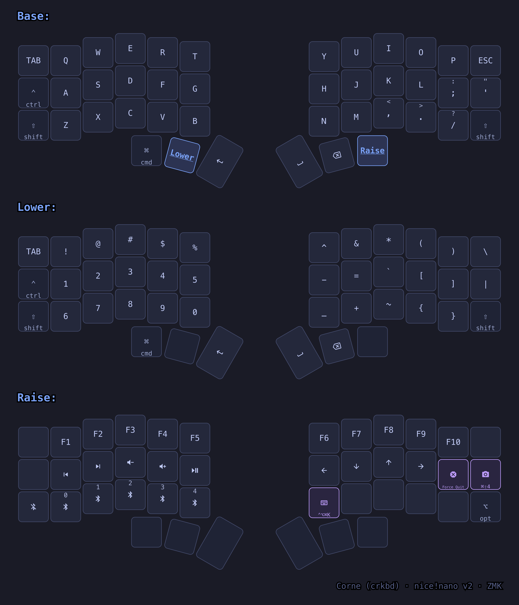

# ZMK Config — Corne (crkbd)

> Personal firmware configuration for a Corne split keyboard on nice!nano v2, with macOS-first bindings.



## Layers

| Layer     | Access                          | Contents                                                                                                                                                                                                   |
| --------- | ------------------------------- | ---------------------------------------------------------------------------------------------------------------------------------------------------------------------------------------------------------- |
| **Base**  | default                         | QWERTY, macOS modifiers (⌘ ⌃, ⇧ on both bottom corners), `' "` quote key, Enter / Space / Backspace on thumbs                                                                                              |
| **Lower** | hold left-thumb middle (`MO 1`) | Symbols on top row, numbers 1–5 / 6–0 on home and bottom rows, brackets and braces on the right                                                                                                            |
| **Raise** | hold right-thumb outer (`MO 2`) | F1–F10, media controls, arrows, Bluetooth profiles, macOS shortcuts (Force Quit ⌥⌘⎋, Screenshot ⌘⇧4, cheatsheet hotkey ⌃⌥⌘K), ⌥ Option on the bottom-right corner (hold Raise + ⌥ + arrows for word jumps) |

The full layout lives in [`config/corne.keymap`](config/corne.keymap) with an ASCII diagram per layer.

## Pre-built firmware

Ready-to-flash images are committed in [`firmware/`](firmware/):

| File                              | Flash to                                                         |
| --------------------------------- | ---------------------------------------------------------------- |
| `corne_left-nice_nano_v2.uf2`     | **Left half** (central — talks to the host)                      |
| `corne_right-nice_nano_v2.uf2`    | **Right half**                                                   |
| `settings_reset-nice_nano_v2.uf2` | **Both halves**, only when resetting stored settings (see below) |

## Flashing

1. Connect the half via USB-C.
2. **Double-tap the reset button** on the nice!nano — a USB drive named `NICENANO` mounts.
3. Drag the matching `.uf2` onto the drive. It ejects itself and reboots with the new firmware.

**Keymap-only changes need reflashing the LEFT half only** — all keymap processing runs on the central side; the right half just reports switch positions. Reflash both halves when changing the ZMK version, `.conf` features, or shields.

### Settings reset (fixes pairing issues / dead halves)

Persisted settings (split pairing, Bluetooth bonds) survive normal reflashing. If the halves stop talking to each other or keys behave inexplicably:

1. Flash `settings_reset-nice_nano_v2.uf2` to **both** halves.
2. Flash the real left/right firmware back.
3. Remove the old keyboard entry from macOS Bluetooth settings, power both halves on next to each other (they re-bond automatically), and re-pair from the Mac.

## Battery & charging indicator

Each half shows its **own battery percentage** on the OLED, with a **⚡ lightning
bolt** in front of it whenever USB power is present — that is the charging signal
(`CONFIG_ZMK_WIDGET_BATTERY_STATUS_SHOW_PERCENTAGE` in
[`config/corne.conf`](config/corne.conf)).

- **⚡ 74%** → plugged in and charging (the percentage climbs over time).
- **⚡ 100%** → plugged in, battery full. ZMK does not distinguish "charging" from
  "charge complete" — the bolt only means USB power is present.
- **74%** (no bolt) → running on battery.

The display blanks after ~30 s idle; **tap any key to wake it** and read the status.
The nice!nano v2 also has an onboard blue charge LED (on while charging, off when
full), but on a Corne it sits hidden under the OLED module — that is why no light
is visible while charging.

## Building

This repo intentionally has **no CI** — firmware is built locally and the resulting `.uf2` images are committed to [`firmware/`](firmware/). ([`build.yaml`](build.yaml) stays as the canonical list of build targets.)

Requires: Zephyr SDK, `cmake`, `ninja`, and a **python3.11** venv (Zephyr 3.5 scripts misbehave on newer Pythons).

```bash
python3.11 -m venv .venv && source .venv/bin/activate
pip install west
west init -l config && west update        # ~3.5 GB on first run
pip install -r zephyr/scripts/requirements-base.txt

export ZEPHYR_TOOLCHAIN_VARIANT=zephyr
export ZEPHYR_SDK_INSTALL_DIR=/opt/zephyr-sdk-0.17.4   # adjust to your SDK
export ZEPHYR_BASE="$PWD/zephyr"

west build -s zmk/app -d build/left  -b nice_nano_v2 -- \
  -DSHIELD=corne_left  -DZMK_CONFIG="$PWD/config" \
  -DCMAKE_PREFIX_PATH="$PWD/zephyr" -DCONFIG_PICOLIBC_USE_MODULE=y
west build -s zmk/app -d build/right -b nice_nano_v2 -- \
  -DSHIELD=corne_right -DZMK_CONFIG="$PWD/config" \
  -DCMAKE_PREFIX_PATH="$PWD/zephyr" -DCONFIG_PICOLIBC_USE_MODULE=y
# outputs: build/<half>/zephyr/zmk.uf2
```

`-DCONFIG_PICOLIBC_USE_MODULE=y` is required with Zephyr SDK ≥ 0.17 (its bundled picolibc is incompatible with Zephyr 3.5). `-DCMAKE_PREFIX_PATH` replaces the `west zephyr-export` registry step.

## Keymap cheatsheet

The cheatsheet above is generated from the keymap by [keymap-drawer](https://github.com/caksoylar/keymap-drawer). After editing the keymap, regenerate SVG + PNG with:

```bash
keymap-drawer/render.sh
```

Dependencies: `pip install keymap-drawer "tree-sitter<0.25" "tree-sitter-devicetree<0.15"` and `brew install librsvg`. Style lives in [`keymap-drawer/config.yaml`](keymap-drawer/config.yaml). The ⌃⌥⌘K key opens this image through a macOS Quick Action (`~/Library/Services/Show Keymap Cheatsheet.workflow`) with ⌃⌥⌘K assigned in System Settings → Keyboard → Keyboard Shortcuts → Services.

## Troubleshooting

### Shifted symbols, F-keys, and media keys "dead" on macOS → check Slow Keys

Case study (2026-07). Every shifted symbol (`!`, `@`, `"`, …), F1–F10, and the media
keys produced nothing, while holding physical Shift + the base key worked fine. The
keymap and firmware were verified correct.

Ruled out first: Karabiner-Elements and BetterTouchTool (not installed), `hidutil`
remappings (returned `(null)`), per-device modifier remaps in Settings → Keyboard,
and the input source (US, correct).

**Root cause: System Settings → Accessibility → Keyboard → Slow Keys was enabled.**
Slow Keys requires every key to be held for a minimum time before it registers. ZMK
sends shifted symbols as one instantaneous HID report (Shift+1 arrives and releases
together), so macOS discarded them as "too brief". Holding physical Shift passed the
filter precisely because it is a long press. Consumer-page media keys and quick
F-key taps fell to the same filter.

**Fix: turn Slow Keys off.** No keymap changes, no reflash, no firmware involvement.

If keys ever "die" suddenly again, check that Accessibility panel first — it can get
enabled by accident through accessibility keyboard shortcuts.

### Split halves not talking / whole half dead

See [Settings reset](#settings-reset-fixes-pairing-issues--dead-halves).

## Project structure

```
config/        # corne.keymap, corne.conf, west manifest
firmware/      # Pre-built .uf2 images (committed)
keymap-drawer/ # Cheatsheet config, SVG/PNG, render script
build.yaml     # Board + shield build matrix
boards/        # Custom board/shield definitions (empty)
```

## Status


